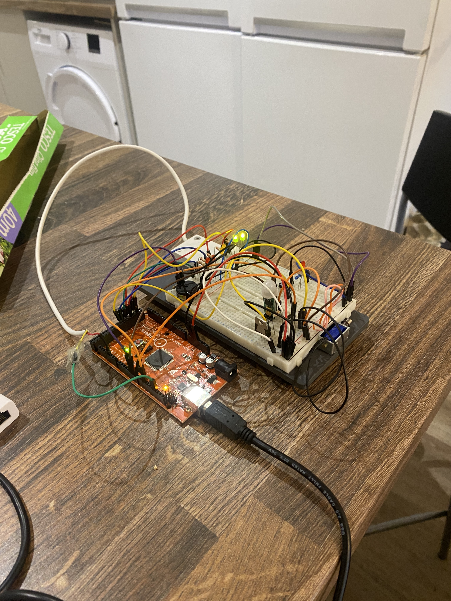

# Embedded Burglar Alarm with Facial Recognition

Built for my System Engineering and OOP module (Year 2, University of Sheffield) as a 4-person team, designed around a fictional casino ("Casino 404") scenario. The C++/Arduino hardware layer was primarily my teammates' work, which I went back through and tidied up. I designed and built the entire Python software layer (the login system, database, and serial bridge to the Arduino).



## What it does

A two-layer security system. The Arduino side reads a door sensor and a motion sensor and drives status LEDs, a buzzer, and a solenoid lock through an `AlarmControlPanel` class that manages arm/disarm state and a panic button. The Python side runs a menu-driven login system that disarms the panel either by 4-digit PIN or by webcam facial recognition, then talks to the Arduino over serial to arm, disarm, or read trigger events.

## Hardware

- Arduino (panel logic in `AlarmControlPanel`, sensors/actuators as their own classes: `Buzzer`, `SolenoidLock`, `StatusLED`, `SwitchSensor`, `MotionSensor`, `Panicbutton`)
- Door (magnetic switch) sensor and PIR motion sensor
- Buzzer and status LEDs (green/yellow/red) for disarmed/armed/alarm states
- Solenoid lock as the actuated output
- Webcam for the Python-side facial recognition

## Repo structure

```
/firmware   - Arduino sketch + hardware classes (Actuator, Admin, AlarmControlPanel, Buzzer, MotionSensor, Panicbutton, Sensor, SolenoidLock, Staff, StatusLED, SwitchSensor, UserProfile)
/software   - Python login system, database, facial recognition, serial bridge
/docs       - System requirements, UML class diagram, final implementation reports
/media      - Photo of the built system
```

## How it works

The Arduino runs a small state machine in `main.ino`: `AlarmControlPanel` tracks armed/disarmed/alarm-triggered state and dispatches to whichever actuators are registered against it, while `Buzzer`, `SolenoidLock`, and the `StatusLED`s all inherit from a common `Actuator` base. On the Python side, `login_system.py` is the entry point, it calls into `pin_auth.py` or `face_auth.py` depending on which method the user picks, checks the result against `database.py` (which reads `database.json` for registered users, PINs, and face encodings), and then `serial_bridge.py` sends the ARM/DISARM commands to the Arduino over serial. `admin_menu.py` and `staff_menu.py` split what each role can do once logged in.

## Software references

The facial recognition system was based on the approach in [this OpenCV + Python webcam face detection guide](https://www.geeksforgeeks.org/python/face-detection-using-python-and-opencv-with-webcam/). The Arduino-Python serial link was written using the [pyserial API docs](https://pyserial.readthedocs.io/en/latest/pyserial_api.html) as a reference.

## Setup

`database.json` in this repo is a placeholder, real PINs and face encodings were stripped before uploading, since that data belongs to real people. To run this yourself, you'll need to register your own users through `register.py`, and separately download `dlib_face_recognition_resnet_model_v1.dat` and `shape_predictor_68_face_landmarks.dat` (not included here) from dlib's model repository.

## What I'd change

The PIN and face-encoding data lived in a single unencrypted JSON file, which was fine for a module demo but isn't how I'd handle real user credentials, next time I'd hash the PINs at minimum, and think harder about where the recognition model files and known-faces images actually need to live. The biggest bit of feedback we received for this project was to implement an alarm cut-off period (say after 20 minutes) so the system doesn't alarm indefinitely!
